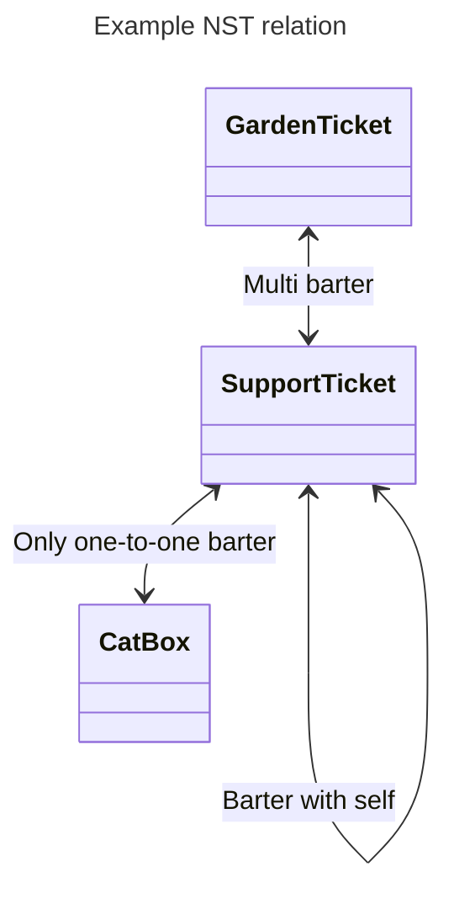

# NST standard dApp

Three contracts has been deployed to illustrate how the standard work, they have relations between each others such as:

## Optimism goerli

Try on the [dApp](https://nst-dapp.vercel.app/)

| Token name     | Token address                                                                                                                         | Metadata IPFS hash                             |
| -------------- | ------------------------------------------------------------------------------------------------------------------------------------- | ---------------------------------------------- |
| Garden Ticket  | [0xc4770fcb3852f19e69be89baae962698c9b3db86](https://goerli-optimism.etherscan.io/address/0xc4770fcb3852f19e69be89baae962698c9b3db86) | QmQskqBAHB615HAFEzpB1FkEuU5Dy6wZc6JEWUjjvcAQ2k |
| Support Ticket | [0xb026c8fe5b22cb7eed1caf1457fe57cf9f3e3b8d](https://goerli-optimism.etherscan.io/address/0xb026c8fe5b22cb7eed1caf1457fe57cf9f3e3b8d) | QmQskqBAHB615HAFEzpB1FkEuU5Dy6wZc6JEWUjjvcAQ2k |
| Cat Box        | [0xf2059ac73323e6f285e472f7ce3b0a38ac66aaf1](https://goerli-optimism.etherscan.io/address/0xf2059ac73323e6f285e472f7ce3b0a38ac66aaf1) | QmPpEkpXsLYqrKbsCE4acEUDcKvg72vBKLVjc1dfvHBAzR |

## Local blockchain

Run a local blockchain and deploy using Foundry, see these [instructions](https://github.com/NST-Standard/NST-Standard#deploy-on-local-blockchain).

Then configure Metamask (or others wallet) network with:

- **network name:** LocalHost 8545
- **new RPC URL:** `http://localhost:8545`
- **chain ID:** 31337
- **symbol:** ETH

And active "Customize transaction nonce" in advanced parameters.
